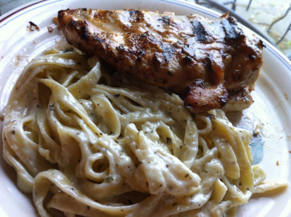
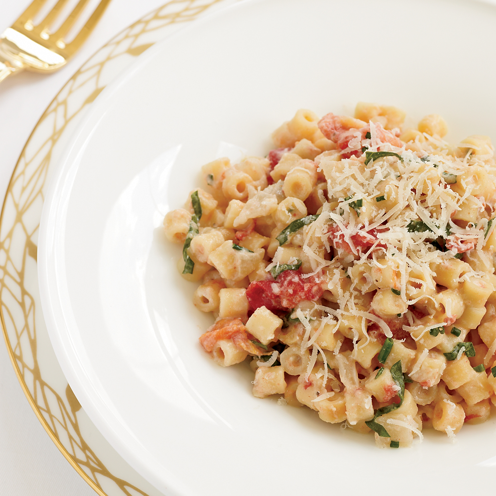
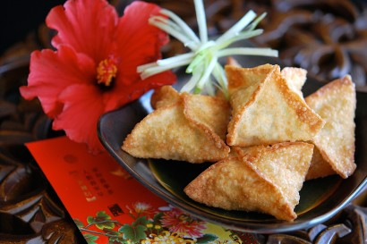
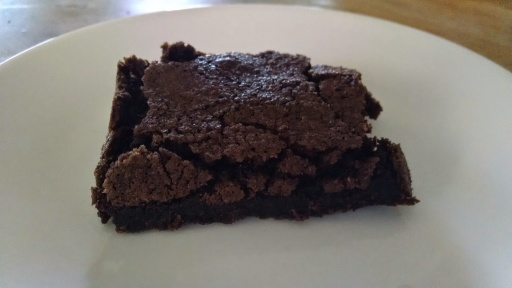
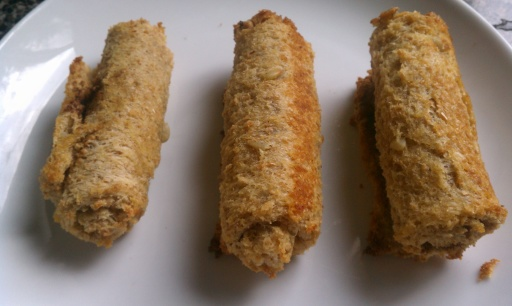

# Validation 100 queries

See results at:
https://docs.google.com/spreadsheets/d/1zEjteejNmUJj2kHE6MEV2z65mdaOgR9y-ow5lCrEgkA/edit?usp=sharing

| idx | query | model1 | model2 | model3|
|:----|:------|:-------|:-------|:------|
|   1 |  |                 [Red Cabbage, Blue Cheese, and Walnut Empanadas](http://www.epicurious.com/recipes/food/views/red-cabbage-blue-cheese-and-walnut-empanadas-104136) |                                                                        [Beer Cheese Soup IV](http://allrecipes.com/recipe/beer-cheese-soup-iv/) |                                                                                 [Beer Cheese Soup IV](http://allrecipes.com/recipe/beer-cheese-soup-iv/) |
|   2 |  |                                                                                              [Granola](http://tastykitchen.com/recipes/breakfastbrunch/granola-7/) |                                                                              [Creamy Noodles](http://www.food.com/recipe/creamy-noodles-116686) |                                                         [Penne in Parmesan Cream Sauce](http://www.food.com/recipe/penne-in-parmesan-cream-sauce-400732) |
|   3 |  |                                                               [Black Bean Sunshine Pasta Salad](http://www.food.com/recipe/black-bean-sunshine-pasta-salad-335837) |                                                                              [No-Knead Bread](http://www.food.com/recipe/no-knead-bread-348028) |                                         [Vickys Baked Cinnamon Bread Rollups](https://cookpad.com/us/recipes/333105-vickys-baked-cinnamon-bread-rollups) |
|   4 |  |                                                                                           [Quick Tomato Sauce](http://www.food.com/recipe/quick-tomato-sauce-7879) |                                [Vegan Cowboy Cookies (Healthy Version)](http://www.food.com/recipe/vegan-cowboy-cookies-healthy-version-459281) |                                                                         [Sugar Free Spice Cookie](http://allrecipes.com/recipe/sugar-free-spice-cookie/) |
|   5 |  |                                                                                                  [Kalamari Salad](http://www.food.com/recipe/kalamari-salad-70187) |                                                                          [Mediterranean Kale](http://allrecipes.com/recipe/mediterranean-kale/) |                                                     [Beetroot Leaf and Ricotta Salad](http://www.food.com/recipe/beetroot-leaf-and-ricotta-salad-246997) |
|   6 |  |                                                                       [Brussels Sprouts 'n Potatoes](http://www.food.com/recipe/brussels-sprouts-n-potatoes-11607) |                             [Bacon No Lettuce & Tomato Dip](http://tastykitchen.com/recipes/appetizers-and-snacks/bacon-no-lettuce-tomato-dip/) |                                                                                               [Basic Crepes](http://allrecipes.com/recipe/basic-crepes/) |
|   7 |  |                                                                   [Radish Leaf / Radish Top Pesto](http://www.food.com/recipe/radish-leaf-radish-top-pesto-435728) |                                                            [Rich Caramel Cheesecake](http://www.food.com/recipe/rich-caramel-cheesecake-234114) |                                                                                 [Orange Snack Cake](http://www.food.com/recipe/orange-snack-cake-116990) |
|   8 |  |                                                             [Cinco De Mayo Margarita Cupcakes](http://www.food.com/recipe/cinco-de-mayo-margarita-cupcakes-515831) |                                                                           [Baked Pork Chops](http://www.food.com/recipe/baked-pork-chops-62542) |                                                                               [Baked Sesame Chicken](http://allrecipes.com/recipe/baked-sesame-chicken/) |
|   9 |  |                                                           [Bean Sprouts And Bean Curd Puff](https://cookpad.com/us/recipes/364366-bean-sprouts-and-bean-curd-puff) |                                                               [Pepperoni Pizza Spread](http://www.food.com/recipe/pepperoni-pizza-spread-78575) |                                           [Creamy Chicken & Broccoli Casserole](https://cookpad.com/us/recipes/330743-creamy-chicken-broccoli-casserole) |
|  10 |  |                                                                                                   [Vanilla Pudding](http://allrecipes.com/recipe/vanilla-pudding/) |               [Super Fudgy Triple Chocolate Espresso Brownies](http://www.food.com/recipe/super-fudgy-triple-chocolate-espresso-brownies-41985) | [One-Bowl Raspberry Chocolate Chip Oatmeal Cookie Bars](http://tastykitchen.com/recipes/desserts/one-bowl-raspberry-chocolate-chip-oatmeal-cookie-bars/) |
|  11 |  |                                                                             [Yummy Mex Skillet Dinner](http://www.food.com/recipe/yummy-mex-skillet-dinner-361807) | [Easy Stove Top Mac and Cheese "It's the Cheesiest ;-)"](https://cookpad.com/us/recipes/349519-easy-stove-top-mac-and-cheese-its-the-cheesiest) |                                              [Danish Browned Cabbage With Caraway](http://www.food.com/recipe/danish-browned-cabbage-with-caraway-12042) |
|  12 |  |                                                                                    [Chocolate Sponge Cake](http://www.food.com/recipe/chocolate-sponge-cake-25340) |                                                                                          [Meatloaf](http://www.food.com/recipe/meatloaf-140228) |                                                                               [BBQ Pork Spareribs](http://www.food.com/recipe/bbq-pork-spareribs-169884) |
|  13 |  |                                                                             [Tomato Sauce for Pizza](https://cookpad.com/us/recipes/149853-tomato-sauce-for-pizza) |                                                          [Broiled Tilapia Parmesan](http://www.food.com/recipe/broiled-tilapia-parmesan-301573) |                                                                                       [Salmon Patties](http://www.food.com/recipe/salmon-patties-364564) |
|  14 |  |                                                                                               [Tortilla Soup](https://cookpad.com/us/recipes/157349-tortilla-soup) |                                         [Tom's Veggie Stuffed 3-Egg Omelet](http://www.food.com/recipe/toms-veggie-stuffed-3-egg-omelet-189505) |   [North Croatian Ham and Pasta Casserole (Krpice Sa Sunkom)](http://www.food.com/recipe/north-croatian-ham-and-pasta-casserole-krpice-sa-sunkom-258936) |
|  15 |  |                                                                  [Strawberry Bacon Romaine Salad](http://www.food.com/recipe/strawberry-bacon-romaine-salad-88618) |                                                          [Turkey Tater Tot Hotdish](http://www.food.com/recipe/turkey-tater-tot-hotdish-276530) |                                                                   [Turkey Tater Tot Hotdish](http://www.food.com/recipe/turkey-tater-tot-hotdish-276530) |
|  16 |  |                                           [Creamy Cherry-Strawberry Smoothies](http://www.kraftrecipes.com/recipes/creamy-cherry-strawberry-smoothies-174775.aspx) |                                                               [Pineapple Cheese Bread](http://www.food.com/recipe/pineapple-cheese-bread-61873) |                                                   [Maple-Bacon Chocolate Chip Cookies](http://allrecipes.com/recipe/maple-bacon-chocolate-chip-cookies/) |
|  17 |  |                                                                         [30-Minute Chili Mac](http://www.kraftrecipes.com/recipes/30-minute-chili-mac-136906.aspx) |                                                                            [Broccoli Salad I](http://allrecipes.com/recipe/broccoli-salad-i-2/) |                                                         [Fast Salmon with a Ginger Glaze](http://allrecipes.com/recipe/fast-salmon-with-a-ginger-glaze/) |
|  18 |  |                                          [Tortilla De Patatas -- Potato Omelet (Spain)](http://www.food.com/recipe/tortilla-de-patatas-potato-omelet-spain-373326) |                                                                                       [Chili Rick's](http://allrecipes.com/recipe/chili-ricks/) |                                                                 [Flourless Chocolate Cake II](http://allrecipes.com/recipe/flourless-chocolate-cake-ii/) |
|  19 |  |                                       [African Style Grilled Peanut Butter Chicken](http://www.food.com/recipe/african-style-grilled-peanut-butter-chicken-456733) |                                                                      [Spicy Perogy Pizza](http://www.food.com/recipe/spicy-perogy-pizza-300850) |                                                     [Bowtie Sundried Tomato Salad](http://tastykitchen.com/recipes/salads/bowtie-sundried-tomato-salad/) |
|  20 |  |                                                     [Judys Strawberry Pretzel Salad](http://tastykitchen.com/recipes/salads/judye28099s-strawberry-pretzel-salad/) |                                                    [Huer Huero Road Green Chili](http://www.food.com/recipe/huer-huero-road-green-chili-334633) |                                                                        [Jim's Cornbread Stuffing](http://allrecipes.com/recipe/jims-cornbread-stuffing/) |
|  21 |  |                                               [Slow-Cooker Cran-Apricot Oatmeal](http://www.kraftrecipes.com/recipes/slow-cooker-cran-apricot-oatmeal-186662.aspx) |                                              [Tuna chicken rice in sofrito](https://cookpad.com/us/recipes/368531-tuna-chicken-rice-in-sofrito) |                                                                [Aarsi's Ultimate Pea Pulao](http://www.food.com/recipe/aarsis-ultimate-pea-pulao-438754) |
|  22 |  |                                                                                             [Fried Eggplant](https://cookpad.com/us/recipes/341917-fried-eggplant) |                                                               [Pineapple Cheese Bread](http://www.food.com/recipe/pineapple-cheese-bread-61873) |                                                                        [Pineapple Cheese Bread](http://www.food.com/recipe/pineapple-cheese-bread-61873) |
|  23 |  |                                                                   [Shrimp Chip and Vegetable Dip](http://www.food.com/recipe/shrimp-chip-and-vegetable-dip-206783) |                                                         [Fabulous Banana Cream Pie](http://www.food.com/recipe/fabulous-banana-cream-pie-66037) |                                                                                         [Caramel Pie](https://cookpad.com/us/recipes/355636-caramel-pie) |
|  24 |  |                                                                                       [Ice Cream Coffee](http://tastykitchen.com/recipes/drinks/ice-cream-coffee/) |                              [Springy Raspberry-Lemon Layer Cake](http://tastykitchen.com/recipes/desserts/springy-raspberry-lemon-layer-cake/) |                                       [Springy Raspberry-Lemon Layer Cake](http://tastykitchen.com/recipes/desserts/springy-raspberry-lemon-layer-cake/) |
|  25 |  |                                      [Hubby's Late Night Thrown Together Egg Salad](http://www.food.com/recipe/hubbys-late-night-thrown-together-egg-salad-458669) |                                                                        [Cajun Chicken Pasta](http://allrecipes.com/recipe/cajun-chicken-pasta/) |                                     [Pesto Pasta with Green Beans and Potatoes](http://allrecipes.com/recipe/pesto-pasta-with-green-beans-and-potatoes/) |
|  26 |  |                                                                       [Chocolate Cornflake Cookies](http://www.food.com/recipe/chocolate-cornflake-cookies-226279) |          [10-Minute Baked Halibut With Garlic-Butter Sauce](http://www.food.com/recipe/10-minute-baked-halibut-with-garlic-butter-sauce-359203) |                                                                      [Cheddar Cheese Krispies](http://www.food.com/recipe/cheddar-cheese-krispies-84993) |
|  27 |  |                                                         [Creamy Cheddar Jalapeno Grits](http://tastykitchen.com/recipes/sidedishes/creamy-cheddar-jalapeno-grits/) |                                                                                [Jamocha Bread](http://www.food.com/recipe/jamocha-bread-505414) |                                                                                         [Jamocha Bread](http://www.food.com/recipe/jamocha-bread-505414) |
|  28 |  |                                                                             [Basil Lemon Garlic Bread](http://www.food.com/recipe/basil-lemon-garlic-bread-356221) |                                                         [Roasted Butternut Squash](http://www.foodandwine.com/recipes/roasted-butternut-squash) |                                                               [Orange-Scented Sweet Potato and Fruit Gratin](http://cooking.nytimes.com/recipes/1015136) |
|  29 |  |                                                                                                       [Figgy Pudding](http://allrecipes.com/recipe/figgy-pudding/) |                                           [Easy Turkey Club Sandwich](http://www.kraftrecipes.com/recipes/easy-turkey-club-sandwich-55841.aspx) |                                                          [VELVEETA-Bacon Burgers](http://www.kraftrecipes.com/recipes/velveeta-bacon-burgers-64289.aspx) |
|  30 |  |                                                                                  [Dreamsicle Jello Salad](http://www.food.com/recipe/dreamsicle-jello-salad-49896) |                                               [Chocolate Buttercream Frosting](http://www.food.com/recipe/chocolate-buttercream-frosting-44126) |                                                                                   [Persian Lemonade](http://www.food.com/recipe/persian-lemonade-314262) |
|  31 |  |                                                                                       [Lemongrass Iced Tea](http://www.food.com/recipe/lemongrass-iced-tea-243613) |                                                                  [Spiced Citrus Compote](http://www.myrecipes.com/recipe/spiced-citrus-compote) |                                                                     [Grapefruit-Banana Smash](http://www.food.com/recipe/grapefruit-banana-smash-219941) |
|  32 |  |                                                                 [Broccoli With Onions and Cumin](http://www.food.com/recipe/broccoli-with-onions-and-cumin-220471) |                                [Potato Wedges With Roasted Garlic Dip](http://www.food.com/recipe/potato-wedges-with-roasted-garlic-dip-227585) |                                                   [Grilled Salmon With Cucumber Salad](http://allrecipes.com/recipe/grilled-salmon-with-cucumber-salad/) |
|  33 |  |                                                                     [Simmered Beans and Kabocha](https://cookpad.com/us/recipes/157474-simmered-beans-and-kabocha) |                                                                                        [Kladdkaka](http://www.food.com/recipe/kladdkaka-327400) |                                                    [Grandmother's Buttermilk Cornbread](http://allrecipes.com/recipe/grandmothers-buttermilk-cornbread/) |
|  34 |  |                                                                                   [Summer Cold Cure](http://www.foodrepublic.com/recipes/summer-cold-cure-recipe/) |                                                                       [Crock Pot Stuffing](http://www.food.com/recipe/crock-pot-stuffing-49609) |                                                                   [Crispy Squid With Capers](http://www.food.com/recipe/crispy-squid-with-capers-300540) |
|  35 |  |                                                                                           [Heavenly Chai Tea](http://www.food.com/recipe/heavenly-chai-tea-423197) |                                              [Apple and Cream Cheese Dessert](http://www.food.com/recipe/apple-and-cream-cheese-dessert-493935) |                                                                    [Boursin Cheese (Homemade)](http://www.food.com/recipe/boursin-cheese-homemade-80675) |
|  36 |  |                                                                           [Kitchen Sink Salad Dressing](http://allrecipes.com/recipe/kitchen-sink-salad-dressing/) |                                                                [Sweet Potato Pound Cake](http://allrecipes.com/recipe/sweet-potato-pound-cake/) |                                                                           [Orange Nut Raisin Cake](http://allrecipes.com/recipe/orange-nut-raisin-cake/) |
|  37 |  |                                                                                     [Blackberry cobbler](https://cookpad.com/us/recipes/333021-blackberry-cobbler) |                                                                  [Chard and Coconut Soup](http://allrecipes.com/recipe/chard-and-coconut-soup/) |                                                                        [Tortellini Soup](http://www.kraftrecipes.com/recipes/tortellini-soup-53463.aspx) |
|  38 |  |                                                                                       [Cheddar Carrot Bake](http://www.food.com/recipe/cheddar-carrot-bake-222245) |                                                                                [Grilled Salmon](http://www.food.com/recipe/grilled-salmon-7760) |                                                                     [Hot Crab and Cheese Dip](http://www.food.com/recipe/hot-crab-and-cheese-dip-270994) |
|  39 |  |                            [Crunchy Peanut Butter Snack Bites with Dates](http://www.kraftrecipes.com/recipes/crunchy-peanut-butter-snack-bites-dates-177631.aspx) |                                                                                [Fritz Martini](http://www.food.com/recipe/fritz-martini-210607) |                                                                               [Luscious Slush Punch](http://allrecipes.com/recipe/luscious-slush-punch/) |
|  40 |  |                                                                               [Grilled Pork & Pineapple](http://www.food.com/recipe/grilled-pork-pineapple-329349) |                              [Baked Macaroni & Cheese with Chiles](http://www.kraftrecipes.com/recipes/baked-macaroni-cheese-chiles-62757.aspx) |                                       [Baked Macaroni & Cheese with Chiles](http://www.kraftrecipes.com/recipes/baked-macaroni-cheese-chiles-62757.aspx) |
|  41 |  |                                                    [Good Old-Fashioned Mashed Potatoes](http://www.delish.com/recipefinder/good-old-fashioned-mashed-potatoes-333) |                                                                     [Bob's Awesome Lasagna](http://allrecipes.com/recipe/bobs-awesome-lasagna/) |                                                                       [Turkey Cheese Strata](http://www.landolakes.com/recipe/3320/turkey-cheese-strata) |
|  42 |  |                                                                       [Cheese 'n Ham Spirals](http://www.kraftrecipes.com/recipes/cheese-n-ham-spirals-98305.aspx) |                                                            [Asian Chicken Pot Pie](https://recipeland.com/recipe/v/asian-chicken-pot-pie-43643) |                                                                                     [Potatoes Supreme](http://allrecipes.com/recipe/potatoes-supreme-2/) |
|  43 |  |                         [Bite-Size Appetizers - Watermelon Stuffed Chikuwa](https://cookpad.com/us/recipes/142980-bite-size-appetizers-watermelon-stuffed-chikuwa) |                                                          [creamy chicken breasts](https://cookpad.com/us/recipes/330944-creamy-chicken-breasts) |                                                                   [creamy chicken breasts](https://cookpad.com/us/recipes/330944-creamy-chicken-breasts) |
|  44 |  |                                                                                       [Stuffed Mushrooms](https://cookpad.com/us/recipes/353020-stuffed-mushrooms) |                                                                                      [Basic Crepes](http://allrecipes.com/recipe/basic-crepes/) |                                                                                           [Paleo Tunamole](http://allrecipes.com/recipe/paleo-tunamole/) |
|  45 |  |                                                               [Vibrant Vegetarian Purple Borscht](http://allrecipes.com/recipe/vibrant-vegetarian-purple-borscht/) |                                                                                   [Saffron Rice](http://www.food.com/recipe/saffron-rice-47592) |                                                                                            [Saffron Rice](http://www.food.com/recipe/saffron-rice-47592) |
|  46 |  |                                                                                     [Cranberry Muffins](http://tastykitchen.com/recipes/breads/cranberry-muffins/) |          [Frozen Yogurt Granita with Fresh Mango Sauce](http://tastykitchen.com/recipes/desserts/frozen-yogurt-granita-with-fresh-mango-sauce/) |                                                         [Tangerine Kombucha Mai Tai](http://tastykitchen.com/recipes/drinks/tangerine-kombucha-mai-tai/) |
|  47 |  |                                                                                       [Smoked Salmon Pasta](http://www.food.com/recipe/smoked-salmon-pasta-142791) |                        [Chicken Cutlet Parmesan With Tomato Sauce](http://www.food.com/recipe/chicken-cutlet-parmesan-with-tomato-sauce-280563) |                                                                                     [Brentwood Pasta](http://www.food.com/recipe/brentwood-pasta-330697) |
|  48 |  |                                                                                                 [Corn Casserole](http://www.food.com/recipe/corn-casserole-507785) |                                                        [Gluten-Free Fluffy Pancakes](http://allrecipes.com/recipe/gluten-free-fluffy-pancakes/) |                                                                       [Fluffy Banana Pancakes](http://www.food.com/recipe/fluffy-banana-pancakes-174232) |
|  49 |  |                 [Grilled Kielbasa Sandwich with Horseradish Sauce](http://tastykitchen.com/recipes/main-courses/grilled-kielbasa-sandwich-with-horseradish-sauce/) |                                                          [Grilled Potatoes and Onion](http://allrecipes.com/recipe/grilled-potatoes-and-onion/) |                                                             [Butternut Squash Fries](http://tastykitchen.com/recipes/sidedishes/butternut-squash-fries/) |
|  50 |  |                                                                                                [Montreal Bagels](http://www.food.com/recipe/montreal-bagels-35261) |                              [Artichoke Spinach Dip from Olive Garden](http://www.food.com/recipe/artichoke-spinach-dip-from-olive-garden-4344) |                [Flying Biscuit's Creamy Dreamy White Cheddar Grits](http://www.food.com/recipe/flying-biscuits-creamy-dreamy-white-cheddar-grits-347323) |
|  51 |  |                                                                 [Blueberry Bran Honey Muffins](https://recipeland.com/recipe/v/blueberry-bran-honey-muffins-34392) |                                    [Roast Sticky Chicken-Rotisserie Style](http://allrecipes.com/recipe/roast-sticky-chicken-rotisserie-style/) |                                                           [Blueberry Buttermilk Waffles](http://www.food.com/recipe/blueberry-buttermilk-waffles-176721) |
|  52 |  |                                                                  [Bird's Lemonade Stand Parfaits](http://www.food.com/recipe/birds-lemonade-stand-parfaits-263783) |                                                   [Bake-Not Brownie Bars](http://www.kraftrecipes.com/recipes/bake-not-brownie-bars-56385.aspx) |                                                                              [Apple-Date-Nut Bars](http://www.food.com/recipe/apple-date-nut-bars-63185) |
|  53 |  |                                                                        [Jason's White Chicken Chili](http://www.food.com/recipe/jasons-white-chicken-chili-334965) |    [Roasted Acorn Squash with Chipotle Vinaigrette](http://tastykitchen.com/recipes/sidedishes/roasted-acorn-squash-with-chipotle-vinaigrette/) |                                     [Cranberry Stuffed Sweet Potatoes](http://www.kraftrecipes.com/recipes/cranberry-stuffed-sweet-potatoes-169658.aspx) |
|  54 |  |                                                                                                    [Have a Blast!](http://www.food.com/recipe/have-a-blast-274261) |                                                                               [Reveillon Salad](http://www.myrecipes.com/recipe/rveillon-salad) |                                                                                        [Reveillon Salad](http://www.myrecipes.com/recipe/rveillon-salad) |
|  55 |  |                                                                   [Old-Fashioned Mashed Potatoes](http://www.food.com/recipe/old-fashioned-mashed-potatoes-375259) |                                                                                [Citrus Dressing](http://allrecipes.com/recipe/citrus-dressing/) |                                                                               [Red Tomato Ketchup](http://www.food.com/recipe/red-tomato-ketchup-258530) |
|  56 |  |                                                  [Swiss and Sun-Dried Tomato Fondue](http://www.kraftrecipes.com/recipes/swiss-sun-dried-tomato-fondue-56481.aspx) |                            [Tropical Delight All Natural Smoothie](https://cookpad.com/us/recipes/332000-tropical-delight-all-natural-smoothie) |                                     [Tropical Delight All Natural Smoothie](https://cookpad.com/us/recipes/332000-tropical-delight-all-natural-smoothie) |
|  57 |  |                                                                          [Brown-Rice Veggie Burgers](http://www.foodandwine.com/recipes/brown-rice-veggie-burgers) |                                                             ['lite' Stuffed Mushrooms](http://www.food.com/recipe/lite-stuffed-mushrooms-16451) |                                           [French Toast With Creamy Maple Syrup](http://www.food.com/recipe/french-toast-with-creamy-maple-syrup-253511) |
|  58 |  |                                                   [Carolina Rice Pudding Brulee](http://www.epicurious.com/recipes/food/views/carolina-rice-pudding-brulee-366889) |                                                                        [Wrecked Golf Cart](http://www.food.com/recipe/wrecked-golf-cart-384085) |                                             [Raw Kale Salad With Tahini Dressing](http://www.food.com/recipe/raw-kale-salad-with-tahini-dressing-498581) |
|  59 |  |                                                       [Greek Stuffed Chicken Breasts](http://tastykitchen.com/recipes/main-courses/greek-stuffed-chicken-breasts/) |                                  [Frouta Ke Yaourti (Greek Fruit Salad)](http://www.food.com/recipe/frouta-ke-yaourti-greek-fruit-salad-425452) |                                                                     [Italian Meatball Burger](http://www.food.com/recipe/italian-meatball-burger-257820) |
|  60 |  |                                                                    [shitty's breakfast sandwich](https://cookpad.com/us/recipes/335416-shittys-breakfast-sandwich) |                                                            [Tomato & Arugula Salad](https://cookpad.com/us/recipes/154946-tomato-arugula-salad) |                                  [Warm Salad of Summer Squash with Swordfish and Feta](http://www.myrecipes.com/recipe/warm-salad-squash-swordfish-feta) |
|  61 |  |                                                                              [Tarek's Irish Stout Fondue](http://allrecipes.com/recipe/tareks-irish-stout-fondue/) |                                                            [Healthy Custard Cream](https://cookpad.com/us/recipes/148529-healthy-custard-cream) |                                                                     [Healthy Custard Cream](https://cookpad.com/us/recipes/148529-healthy-custard-cream) |
|  62 |  |                                                                                                           [Snack Mix](http://www.food.com/recipe/snack-mix-395854) |                                                          [Holiday OREO Bark](http://www.kraftrecipes.com/recipes/holiday-oreo-bark-138522.aspx) |                                                                   [Holiday OREO Bark](http://www.kraftrecipes.com/recipes/holiday-oreo-bark-138522.aspx) |
|  63 |  |                                                                                       [Vegan Red Lentil Soup](http://allrecipes.com/recipe/vegan-red-lentil-soup/) |                                                                              [Mango Bread](http://tastykitchen.com/recipes/breads/mango-bread/) |                                                                        [Lamb Chops Fried in Parmesan Batter](http://cooking.nytimes.com/recipes/1015376) |
|  64 |  |                                                                                         [Lemon Pound Cake](https://cookpad.com/us/recipes/243811-lemon-pound-cake) |                                                                  [Easy Cheesy Biscuits](http://www.food.com/recipe/easy-cheesy-biscuits-289629) |                                                     [Baked Cinnamon Donuts Doughnuts](http://www.food.com/recipe/baked-cinnamon-donuts-doughnuts-314294) |
|  65 |  |                                                       [Mexican quinoa & bean casserole (V)](https://cookpad.com/us/recipes/357235-mexican-quinoa-bean-casserole-v) |                    [Oven-Fried Chicken With Beer and Buttermilk](http://www.food.com/recipe/oven-fried-chicken-with-beer-and-buttermilk-174505) |                             [Oven-Fried Chicken With Beer and Buttermilk](http://www.food.com/recipe/oven-fried-chicken-with-beer-and-buttermilk-174505) |
|  66 |  |                                                                                                [Liz's Banana Bars](http://allrecipes.com/recipe/lizs-banana-bars/) |                                                            [Mexican Mashed Potatoes](http://www.food.com/recipe/mexican-mashed-potatoes-124301) |                                                                                 [Yummy Quesadillas](http://www.food.com/recipe/yummy-quesadillas-364015) |
|  67 |  |                                 [Green Salad with Warm Rice & Lemony Dressing](http://tastykitchen.com/recipes/salads/green-salad-with-warm-rice-lemony-dressing/) |                                                      [Red Beans and Rice with SPAM](http://allrecipes.com/recipe/red-beans-and-rice-with-spam/) |                                                               [Red Beans and Rice with SPAM](http://allrecipes.com/recipe/red-beans-and-rice-with-spam/) |
|  68 |  |                                                                           [Filipino Pork Picadillo](https://cookpad.com/us/recipes/359641-filipino-pork-picadillo) |  [Grilled Chicken Breast with Cucumber and Pepper Relish](http://allrecipes.com/recipe/grilled-chicken-breast-with-cucumber-and-pepper-relish/) |           [Grilled Chicken Breast with Cucumber and Pepper Relish](http://allrecipes.com/recipe/grilled-chicken-breast-with-cucumber-and-pepper-relish/) |
|  69 |  |                               [Garlic Shoot Bokkeum (Korean-Style Saute Dish)](https://cookpad.com/us/recipes/171615-garlic-shoot-bokkeum-korean-style-saute-dish) |                                                                                            [Granola](http://www.food.com/recipe/granola-486554) |                                                                                                     [Granola](http://www.food.com/recipe/granola-486554) |
|  70 |  |                                                         [Chana Masala (Chickpeas and Tomatoes)](http://allrecipes.com/recipe/chana-masala-chickpeas-and-tomatoes/) |                                                              [Barbecued Shrimp](http://tastykitchen.com/recipes/main-courses/barbecued-shrimp/) |                                                     [Hot & Spicy Chicken Wings](http://www.kraftrecipes.com/recipes/hot-spicy-chicken-wings-143710.aspx) |
|  71 |  |                                                                      [Roast Stuffed Chicken](http://www.kraftrecipes.com/recipes/roast-stuffed-chicken-74260.aspx) |                                                                  [Emerald Isle Martini](http://www.food.com/recipe/emerald-isle-martini-217397) |                                                                       [Pink Hibiscus Cocktail](http://www.food.com/recipe/pink-hibiscus-cocktail-305025) |
|  72 |  |                                                                                           [Old Fashioned Fudge](http://allrecipes.com/recipe/old-fashioned-fudge/) |                                               [Crispy Coconut-Oatmeal Cookies](http://www.food.com/recipe/crispy-coconut-oatmeal-cookies-45620) |                                                                                 [Oatmeal Scotchies](http://www.food.com/recipe/oatmeal-scotchies-216915) |
|  73 |  |                                                                                      [Chocolate Swirl Cheesecake](http://www.kraftrecipes.com/recipes/-17750.aspx) |               [Barefoot Contessa's Parmesan Roasted Asparagus](http://www.food.com/recipe/barefoot-contessas-parmesan-roasted-asparagus-202464) |                                                                               [Oriental Asparagus](http://www.food.com/recipe/oriental-asparagus-409150) |
|  74 |  |    [Lemon Vanilla Pancakes with Fresh Blueberries](http://tastykitchen.com/recipes/breakfastbrunch/pancakeswaffles/lemon-vanilla-pancakes-with-fresh-blueberries/) |                                                    [Pomegranate Paradise](http://www.kraftrecipes.com/recipes/pomegranate-paradise-148600.aspx) |                                                             [Pomegranate Paradise](http://www.kraftrecipes.com/recipes/pomegranate-paradise-148600.aspx) |
|  75 |  |                                                                               [Chinese Chicken Salad](https://cookpad.com/us/recipes/343374-chinese-chicken-salad) |                                                      [Roasted Gourmet Vegetables](http://www.food.com/recipe/roasted-gourmet-vegetables-220820) |                                                               [No-Mayonnaise Ranch Dressing](http://allrecipes.com/recipe/no-mayonnaise-ranch-dressing/) |
|  76 |  |                                                               [Mini Shrimp Cocktail Appetizers](http://www.food.com/recipe/mini-shrimp-cocktail-appetizers-278872) |                                              [Potato Salad With Curried Mayo](http://www.food.com/recipe/potato-salad-with-curried-mayo-142045) |                                     [German Deli Cucumber Salad (Gurkensalat)](http://www.food.com/recipe/german-deli-cucumber-salad-gurkensalat-107796) |
|  77 |  |                                                                                             [Broccoli Elegant](http://www.food.com/recipe/broccoli-elegant-351863) |                                        [Chinese 5-Spice Salmon Stir-fry](https://cookpad.com/us/recipes/302244-chinese-5-spice-salmon-stir-fry) |                                                 [Chinese 5-Spice Salmon Stir-fry](https://cookpad.com/us/recipes/302244-chinese-5-spice-salmon-stir-fry) |
|  78 |  |                                                                                          [Meatball Hoagies!!!](http://www.food.com/recipe/meatball-hoagies-285347) |                                                      ["leftovers" Spaghetti Sauce](http://www.food.com/recipe/leftovers-spaghetti-sauce-100870) |                                                             [Creamy Zucchini with Linguine](http://allrecipes.com/recipe/creamy-zucchini-with-linguine/) |
|  79 |  |                                                     [Homemade Lemon Pepper Seasoning](http://tastykitchen.com/recipes/condiments/homemade-lemon-pepper-seasoning/) |                                                                                      [Basic Crepes](http://allrecipes.com/recipe/basic-crepes/) |                                                                                                 [Panettone I](http://allrecipes.com/recipe/panettone-i/) |
|  80 |  |                                                                                          [Cafe Chimes Hummus](http://www.food.com/recipe/cafe-chimes-hummus-87906) |                                                             [Boston Cream Pie](http://www.kraftrecipes.com/recipes/boston-cream-pie-92009.aspx) |                                                                      [Boston Cream Pie](http://www.kraftrecipes.com/recipes/boston-cream-pie-92009.aspx) |
|  81 |  |                                                                 [Skinny Red Velvet Truffles](http://tastykitchen.com/recipes/desserts/skinny-red-velvet-truffles/) |                                                                                [Stuffed Peppers](http://allrecipes.com/recipe/stuffed-peppers/) |                                                                          [Broccoli Bacon Quiche](http://www.food.com/recipe/broccoli-bacon-quiche-20480) |
|  82 |  |                                                                       [Sufganiyot (Jelly Doughnuts)](http://www.food.com/recipe/sufganiyot-jelly-doughnuts-200352) |                         [Toasted 2-Cheese Confetti Crackers](http://www.kraftrecipes.com/recipes/toasted-2-cheese-confetti-crackers-55998.aspx) |                                                [Easy Raisin Bran-Date Bread](http://www.kraftrecipes.com/recipes/easy-raisin-bran-date-bread-55253.aspx) |
|  83 |  |                                                    [Baked Spinach, Crab and Artichoke Dip](http://www.food.com/recipe/baked-spinach-crab-and-artichoke-dip-306539) |                                                                  [Mocha Pudding Cups](http://www.landolakes.com/recipe/3104/mocha-pudding-cups) |                                                                           [Mocha Pudding Cups](http://www.landolakes.com/recipe/3104/mocha-pudding-cups) |
|  84 |  |                    [Grandma's Dumplings from Scratch: 100+ Year Old Recipe](http://www.food.com/recipe/grandmas-dumplings-from-scratch-100-year-old-recipe-433467) |                                                                             [Broccoli Gratin](http://www.food.com/recipe/broccoli-gratin-19026) |                                                                                      [Broccoli Gratin](http://www.food.com/recipe/broccoli-gratin-19026) |
|  85 |  |                                                                               [Wheat Germ Sesame Bread](http://www.food.com/recipe/wheat-germ-sesame-bread-102493) |                                                               [Tasty Hot Potato Salad](http://www.food.com/recipe/tasty-hot-potato-salad-98548) |           [Wheat Berry Waldorf Salad with Citrus Vinaigrette](http://tastykitchen.com/recipes/salads/wheat-berry-waldorf-salad-with-citrus-vinaigrette/) |
|  86 |  |                                        [Jenny's Delicious Ham and Pinto Bean Soup](https://cookpad.com/us/recipes/348813-jennys-delicious-ham-and-pinto-bean-soup) |                                                            [Strawberry Lemon Cake](https://recipeland.com/recipe/v/strawberry-lemon-cake-43962) |                                              [Cinnabon Cinnamon Rolls for the ABM](http://www.food.com/recipe/cinnabon-cinnamon-rolls-for-the-abm-75775) |
|  87 |  |                                   [Linguine With Grilled Shrimp and Black Olives](http://www.food.com/recipe/linguine-with-grilled-shrimp-and-black-olives-274883) |            [Apple-Chestnut Soup with Parsley Croutons Recipe](http://www.chowhound.com/recipes/apple-chestnut-soup-with-parsley-croutons-11151) |                            [Ginger-Crusted Salmon with Melon Salsa](http://www.delish.com/recipefinder/ginger-crusted-salmon-melon-salsa-recipe-ghk0711) |
|  88 |  |                                                   [Sausage Breakfast Gravy (For Biscuits)](http://www.food.com/recipe/sausage-breakfast-gravy-for-biscuits-392062) |                                                                  [Scarlet Harlot Recipe](http://www.chowhound.com/recipes/scarlet-harlot-25942) |                                                                                       [Banana Pudding I](http://allrecipes.com/recipe/banana-pudding-i/) |
|  89 |  |                                                                 [Healthy Lemon Cupcake Frosting](http://www.food.com/recipe/healthy-lemon-cupcake-frosting-350989) |                             [Aunt Pat's Chocolate Butterscotch Candy](http://www.food.com/recipe/aunt-pats-chocolate-butterscotch-candy-164459) |                                      [Aunt Pat's Chocolate Butterscotch Candy](http://www.food.com/recipe/aunt-pats-chocolate-butterscotch-candy-164459) |
|  90 |  |                                                                       [Pan Au Lait (French Rolls)](https://cookpad.com/us/recipes/168191-pan-au-lait-french-rolls) |                                                [6 min microwave banana cake](https://cookpad.com/us/recipes/334569-6-min-microwave-banana-cake) |            [Superb! Non-Oil Okara Pound Cake (Green Tea Flavor)](https://cookpad.com/us/recipes/146015-superb-non-oil-okara-pound-cake-green-tea-flavor) |
|  91 |  |                                  [Harrington's Favorite Ham and Cheese Casserole](http://www.food.com/recipe/harringtons-favorite-ham-and-cheese-casserole-475751) |                                                                   [Crock Pot Enchiladas](http://www.food.com/recipe/crock-pot-enchiladas-82441) |                                                           [Pear Raspberry Coconut Bread](http://www.food.com/recipe/pear-raspberry-coconut-bread-254580) |
|  92 |  |                                                   [Quick Savory Chicken Salad Pita](http://tastykitchen.com/recipes/main-courses/quick-savory-chicken-salad-pita/) |                                            [Chocolate Mint Souffles for Two](http://www.food.com/recipe/chocolate-mint-souffles-for-two-451407) |                                                  [Chocolate Chip Pecan Banana Bread](http://www.food.com/recipe/chocolate-chip-pecan-banana-bread-80626) |
|  93 |  |                                                                                       [Hot Collard Slaw](http://www.delish.com/recipefinder/hot-collard-slaw-4560) |                                                  [Layered Meatball Bake](http://www.kraftrecipes.com/recipes/layered-meatball-bake-107631.aspx) |                                               [Cheesy Green Bean Casserole](http://www.kraftrecipes.com/recipes/cheesy-green-bean-casserole-114799.aspx) |
|  94 |  |                                                         [Pumpkin Pecan Cream Cheese Muffins](http://www.food.com/recipe/pumpkin-pecan-cream-cheese-muffins-193332) |                          [Grilled Turkey and Swiss Panini Sandwich](http://www.food.com/recipe/grilled-turkey-and-swiss-panini-sandwich-308195) |                                                                                   [Fried Egg Sandwich](http://allrecipes.com/recipe/fried-egg-sandwich/) |
|  95 |  | [Easy Prosciutto, Caramelized Onion & Goat Cheese Tart](http://tastykitchen.com/recipes/appetizers-and-snacks/easy-prosciutto-caramelized-onion-goat-cheese-tart/) |                          [Chick-Fil-A Chicken (And Nuggets) Copycat](http://www.food.com/recipe/chick-fil-a-chicken-and-nuggets-copycat-439307) |                                                                                 [Bacon Cheese Ball](http://www.food.com/recipe/bacon-cheese-ball-411465) |
|  96 |  |                                                                         [Asparagus-Orzo Soup](http://www.kraftrecipes.com/recipes/asparagus-orzo-soup-147497.aspx) |                                               [Kokos- Och Honungstackt Ananas](http://www.food.com/recipe/kokos-och-honungst-ckt-ananas-421725) |                             [Easy in the Microwave Cheesy French Toast](https://cookpad.com/us/recipes/153941-easy-in-the-microwave-cheesy-french-toast) |
|  97 |  |                                                                                          [Black Lentil Soup](http://www.foodandwine.com/recipes/black-lentil-soup) |                                                [Amazingly Easy Irish Soda Bread](http://allrecipes.com/recipe/amazingly-easy-irish-soda-bread/) |                                                         [Amazingly Easy Irish Soda Bread](http://allrecipes.com/recipe/amazingly-easy-irish-soda-bread/) |
|  98 |  |                                                                                         [Italian Cheese Bread](http://allrecipes.com/recipe/italian-cheese-bread/) |                                                              [Blueberry Oat Dream Bars](http://allrecipes.com/recipe/blueberry-oat-dream-bars/) |                                                                           [Impossible Peach Pie](http://www.food.com/recipe/impossible-peach-pie-414466) |
|  99 |  |                                                                                                 [Eggs Caprese](https://cookpad.com/us/recipes/358152-eggs-caprese) |                                                                            [Beef Tips](http://tastykitchen.com/recipes/main-courses/beef-tips/) |                                                           [My Chili Recipe (Crock Pot)](https://cookpad.com/us/recipes/428538-my-chili-recipe-crock-pot) |
| 100 |  |                                           [How to Rinse Oysters to a Glossy Finish](https://cookpad.com/us/recipes/148389-how-to-rinse-oysters-to-a-glossy-finish) |                                           [Grandmother's Buttermilk Cornbread](http://allrecipes.com/recipe/grandmothers-buttermilk-cornbread/) |                                                    [Grandmother's Buttermilk Cornbread](http://allrecipes.com/recipe/grandmothers-buttermilk-cornbread/) |
